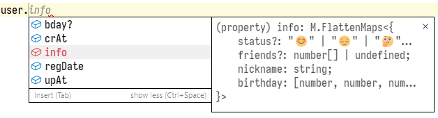

# mongoose-zod

A library which allows to author [mongoose](https://github.com/Automattic/mongoose) ("a MongoDB object modeling tool") schemas using [zod](https://github.com/colinhacks/zod) ("a TypeScript-first schema declaration and validation library").

## Purpose

Declaring mongoose schemas in TypeScript environment has always been tricky in terms of getting the most out of type safety:
* You either have to first declare an interface representing a document in MongoDB and then create a schema corresponding to that interface (you get no type safety at all - even the offical mongoose documentation says that "you as the developer are responsible for ensuring that your document interface lines up with your Mongoose schema")
* Or reverse things by using `mongoose.InferSchemaType<typeof schema>` which is far from ideal (impossible to narrow types, doesn't support TS enums, doesn't know about virtuals, has problems with fields named `type`, ...)
* Finally, you can use [typegoose](https://github.com/typegoose/typegoose) which is based on legacy decorators proposal and generally poorly infers types.

This library aims to solve many of the aforementioned problems utilizing `zod` as a schema authoring tool.

## Usage

Install the package from [npm](https://www.npmjs.com/package/mongoose-zod):

```shell
npm i mongoose-zod
```

⚠️ Do not forget to also install peer dependencies being `zod` and `mongoose`.

Then, define a schema and use it as follows:

```ts
import {z} from 'zod';
import {genTimestampsSchema, toMongooseSchema, zodMongooseCustomType} from 'mongoose-zod';

export const userZodSchema = z
  .object({
    // Sub schema
    info: z.object({
      // Define type options
      nickname: z.string().min(1).mongooseTypeOptions({unique: true}),
      birthday: z.tuple([
        z.number().int().min(1900),
        z.number().int().min(1).max(12),
        z.number().int().min(1).max(31),
      ]),
      // Unlike mongoose, arrays won't have an empty array `[]` as a default value!
      friends: z.number().int().min(1).array().optional(),
      // Making the field optional
      status: z.enum(['😊', '😔', '🤔']).optional(),
      // Use this special method to use special (Buffer, ObjectId, ...) and custom (Long, ...) types
      avatar: zodMongooseCustomType('Buffer'),
    }),
    // Default values set with zod's .default() are respected
    regDate: z.date().default(new Date()),
  })
  // Schema merging supported natively by zod. We make use of this feature
  // by providing a schema generator for creating type-safe timestamp fields
  .merge(genTimestampsSchema('crAt', 'upAt'))
  // Define schema options here:
  .mongoose({
    schemaOptions: {
      collection: 'users',

      // Full type safety in virtuals, as well as in statics, methods and query methods
      virtuals: {
        bday: {
          get() {
            const [y, m, d] = this.info.birthday;
            return new Date(y, m - 1, d);
          },
          set(d: Date) {
            this.info.birthday = [d.getFullYear(), d.getMonth() + 1, d.getDate()];
          },
        },
      },

      statics: { ... },
      methods: { ... },
      query: { ... },
    },

    // Ability to override type schema options
    typeOptions: {
      upAt: {
        index: false,
      },
    },
  });

const UserSchema = toMongooseSchema(userZodSchema);

const User = M.model('User', UserSchema);

const user = new User().toJSON();
```

Result:



## Additional safety measures

Since the overarching goal of this library is to simplify working with mongoose schemas, one way to accomplish that is to also get rid of non-obvious, too permissive or annoying behaviour of mongoose. That's why by default:

- Arrays **won't** have an empty array `[]` set as a default value (it is `undefined` instead, but you will be able to override it).
- Schemas **won't** have an `id` virtual.
- Sub schemas **won't** be set an `_id` property.
- All array field **will not allow** casting of non-array values to arrays.
- Casting is also **disabled** for types like number, string, boolean and date and **cannot** be re-enabled.

⚠️ Please also see [caveats](#caveats) section.

## FAQ

### What zod types are supported and how are they mapped to mongoose types?

| zod type                         | mongoose type        |
| :------------------------------- | :------------------- |
| `String`                         | our special type     |
| `Number`                         | ^                    |
| `Boolean`                        | ^                    |
| `Date`                           | ^                    |
| `Literal`                        | ^                    |
| `NaN`                            | ^                    |
| `Null`                           | ^                    |
| `Enum`                           | ^                    |
| `NativeEnum`                     | ^                    |
| `Type`                           | `Mixed`              |
| `TypeAny`                        | ^                    |
| `Unknown`                        | ^                    |
| `Record`                         | ^                    |
| `Union`                          | ^                    |
| `DiscriminatedUnion`<sup>*</sup> | ^                    |
| `Intersection`                   | ^                    |
| `Map`                            | `Map`                |
| `Any`                            | depends<sup>**</sup> |
| other types                      | not supported        |

<sup>*</sup> Has nothing to do with `mongoose` discriminated unions.<br>
<sup>**</sup> A class provided with `zodMongooseCustomType()` or `Mixed` instead.

If a Zod type is not supported, a `MongooseZodError` error will be thrown upon schema creation.

### How to obtain a schema type and what to do with it?

You have two options:
- Infer *zod schema* type as follows: `type SchemaType = z.infer<typeof zodSchema>`.
- Infer *mongoose schema* type as follows: `type SchemaType = mongoose.InferSchemaType<typeof MongooseSchema>`.

The good thing is they both should be equal! Then you can use it say in your frontend code by using TypeScript's *[type only import](https://www.typescriptlang.org/docs/handbook/release-notes/typescript-3-8.html)* to make sure no actual code is imported, only types:

```ts
// user.model.ts (backend):
...
const userZodSchema = z.object({ ... }).mongoose();
const UserSchema = toMongooseSchema(userZodSchema);
...
export type IUser = z.infer<typeof userZodSchema>;
// OR
export type IUser = mongoose.InferSchemaType<typeof UserSchema>;
...

// somewhere on frontend, notice "import type":
import type {IUser} from '<...>/user.model';
...
```

### How to use special types like `Buffer`, `ObjectId`, `Decimal128` or custom ones like `Long`?

Use a *stand-alone* function called `zodMongooseCustomType`.

```ts
import {z} from 'zod';
import {zodMongooseCustomType} from 'mongoose-zod';

const zodSchema = z.object({
  refs: zodMongooseCustomType('ObjectId').array(),
  data: zodMongooseCustomType('Buffer').optional(),
}).mongoose();
```

### Don't we still have type safety for options like `alias` and `timestamp`?

Yes, we don't. Instead `timestamp`, merge your schema with a timestamps schema generator exported under the `genTimestampsSchema` name.

Instead `alias`, simply use a virtual (which is what mongoose aliases actually are).

⚠️ Please also see [caveats](#caveats) section.

## Caveats

### Regular mongoose validators won't work

Since we use a custom mongoose type for all the primitive zod types, zod enums, as well as zod union of primitives (to disable value casting), "regular" mongoose type-specific validators like `min`, `maxlength` won't have any effects and will be effectively ignored. Validators declared under `validate` property will still work as expected.

### TS error: can't assign a Buffer to a field having `Buffer` type

That's because this field would have `mongoose.Types.Buffer` type which extends the native `Buffer`. Just use `as mongoose.Types.Buffer` after the expression you assign to such a field.

## License

See `LICENSE.md`.